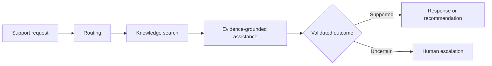

# Helix Support Intelligence

> Production-oriented search, routing, recommendation, and evidence-grounded assistance for customer-support operations.

[](https://github.com/rolffcoelho-bravo/helix-support-intelligence/actions/workflows/ci.yml)
[](#project-status)
[](https://www.python.org/)
[](LICENSE)

Helix Support Intelligence is a public applied-AI engineering project focused on a demanding operational question:

> How can a support platform automate useful decisions while keeping evidence, uncertainty, safety, latency, and cost observable?

The project combines machine learning, information retrieval, ranking, and generative AI inside one controlled support workflow. Language models are treated as replaceable components, not as the system itself.

## What Helix does

Helix is designed to support a fictional digital-banking service desk. It processes customer questions and helps determine the appropriate operational outcome:

- identify intent and route tickets;
- detect uncertain or out-of-scope requests;
- retrieve and rank relevant knowledge articles;
- recommend the next useful policy or resolution;
- draft responses grounded in approved evidence;
- attach traceable citations;
- request clarification or escalate when automation is unsafe.

The repository uses public or fictional data. It does not connect to real bank accounts, initiate transactions, or contain real customer information.

## Current release evidence

Only results produced by frozen reproducible evaluation are reported.

| System | Routing macro-F1 | nDCG@10 | Unsupported claims | P95 latency | Cost/request |
|---|---:|---:|---:|---:|---:|
| Baseline | pending | pending | pending | pending | pending |
| Phase 2 routing candidate | **0.9016** | pending | pending | pending | pending |

The routing value above is the **one-shot official BANKING77 confirmatory test result** for the frozen Phase 2 A2 router. It is not a projected number and it was not used for tuning.

Additional Phase 2 confirmatory evidence:

- balanced accuracy: **0.9016**;
- top-3 recall: **0.9744**;
- 15-bin ECE: **0.0169**;
- Brier score: **0.1456**;
- full-automation routing error risk: **9.84%**;
- routing error risk at exactly 75% confidence-ranked coverage: **1.95%**;
- H4 selective-abstention verdict: **supported** with paired-bootstrap 95% CI for selective-minus-full risk of **[-8.78 pp, -6.96 pp]**.

H3 requires more careful wording. On development evidence, calibration did **not** reduce the registered mixed routing-cost endpoint. On the untouched BANKING77 test, the independently estimable in-domain H3 component is **inconclusive**: calibrated-minus-raw cost `+0.0041`, 95% CI `[-0.0260, 0.0300]`. The synthetic OOS benchmark participated in development selection and is therefore not counted as independent confirmatory evidence.

Permanent evidence is under `benchmarks/routing/results/confirmatory_test_v1.{json,md}` and `benchmarks/routing/results/confirmatory_post_audit_v1.{json,md}`.

## Product workflow



The public [product contract](docs/product-contract.md) defines the finite v1 scope and every allowed terminal decision. The [architecture record](docs/architecture.md) describes the production boundaries without exposing confidential implementation material.

## Core capabilities

### Intelligent ticket routing

Helix models fine-grained customer intent, operational destination, uncertainty, and out-of-scope behaviour. Its purpose is not to maximize automation blindly, but to distinguish decisions that can be automated from those requiring human judgment.

Phase 2 freezes the selected routing configuration as A2: `sentence-transformers/all-MiniLM-L6-v2` embeddings plus a logistic-regression classifier, temperature scaling at `0.457974`, and automatic routing only when maximum calibrated class probability is at least `0.892704`.

### Hybrid search and ranking

The retrieval layer will combine lexical and semantic search with reranking. Search quality is evaluated independently from generated answers so retrieval failures remain visible rather than hidden behind fluent text.

Retrieval implementation belongs to Phase 3 and has **not started** in the Phase 2 branch.

### Evidence-grounded assistance

Generated responses are constrained by retrieved knowledge and returned with citations. Unsupported, ambiguous, or conflicting cases are designed to fail safely through clarification or escalation.

### Next-best-resolution recommendation

Helix ranks relevant articles, approved troubleshooting paths, clarification questions, and escalation destinations for support agents. Recommendations remain read-only.

### Evaluation and observability

Model quality, retrieval relevance, calibration, citation behaviour, latency, cost, and operational decisions are treated as measurable system properties. The project emphasizes reproducible comparisons against clear baselines.

## Phase 2 routing evidence

The routing phase deliberately used a bounded model ladder rather than open-ended model shopping.

| Model | Development macro-F1 | Balanced accuracy | Top-3 recall | Outcome |
|---|---:|---:|---:|---|
| A1 TF-IDF + logistic regression | 0.8422 | 0.8407 | 0.9534 | simpler reference |
| **A2 MiniLM embeddings + logistic regression** | **0.8986** | **0.8963** | **0.9732** | **selected** |
| A3 fixed three-epoch fine-tuning | 0.6898 | 0.7105 | 0.9226 | registered negative result |

Temperature scaling improved A2 validation ECE from about `0.2910` to `0.0162`, Brier from `0.2501` to `0.1398`, and NLL from `0.6683` to `0.3350` without changing classification decisions.

The separate frozen development OOS benchmark contains 160 support-like queries across 20 categories. A2 achieved OOS AUROC `0.8956`, but the ID false-positive rate at at least 95% OOS recall remained `0.4342`. This benchmark remains **development evidence only**.

The Phase 2 cost matrix uses explicit synthetic decision-analysis units and is not claimed to represent real-bank economics.

## Confirmatory routing result

The official 3,080-row BANKING77 test split remained sealed throughout model, calibration, cost, OOS, and threshold selection. Before it was opened, a pre-confirmatory audit machine-verified 36 frozen scientific and execution artifacts.

The one authorized scientific run produced:

| Confirmatory quantity | Result |
|---|---:|
| Accuracy | 0.9016 |
| Macro-F1 | 0.9016 |
| Balanced accuracy | 0.9016 |
| Top-3 recall | 0.9744 |
| ECE | 0.0169 |
| Brier | 0.1456 |
| NLL | 0.3467 |
| Full risk | 9.84% |
| Risk at 75% coverage | 1.95% |
| H4 selective-minus-full risk | -7.89 pp |

At the frozen application threshold `0.892704`, realized test coverage is **74.12%** and selective risk is **1.88%**. The threshold was not moved post hoc to force 75% test coverage.

Three unsafe high-risk wrong automatic routes remain at that frozen threshold. This residual failure mode is part of the published limitations.

The post-result hostile audit independently reconstructed event costs, routing decisions, the H3 and H4 point estimates, and both 5,000-replicate bootstrap confidence intervals exactly.

## Engineering character

Helix is developed as a production-shaped repository rather than a notebook demonstration. The intended engineering surface includes:

- typed Python packages and API contracts;
- reproducible dependency and data management;
- automated testing and quality checks;
- versioned models, prompts, corpora, and configurations;
- containerized local execution;
- experiment tracking and model lifecycle management;
- traces, metrics, dashboards, and safe failure behaviour;
- public documentation for data provenance, limitations, and responsible use.

Exploratory notebooks may support analysis, but they do not contain the authoritative production implementation.

## Quick start

Prerequisites: Python 3.12+ and [uv](https://docs.astral.sh/uv/).

```bash
git clone https://github.com/rolffcoelho-bravo/helix-support-intelligence.git
cd helix-support-intelligence
make setup
make quality
uv run helix
```

The command returns foundation metadata and the declared terminal-decision vocabulary. It does not simulate capabilities whose implementation phase has not yet been completed.

Stable development commands:

```bash
make lint
make typecheck
make test
make data-check
make publication-audit
make quality
```

## Technology direction

The planned stack is centered on Python, FastAPI, scikit-learn, PyTorch, Transformers, hybrid information retrieval, MLflow, OpenTelemetry, PostgreSQL, Redis, Docker Compose, and GitHub Actions.

Technology choices remain subordinate to measurable product value. A more complex component is adopted only when it demonstrates a meaningful advantage over a simpler baseline.

## Evaluation philosophy

Helix separates five forms of evidence:

| Layer | Representative evidence |
|---|---|
| Routing | classification quality, calibration, selective coverage |
| Retrieval | ranking relevance, recall, latency |
| Assistance | factual support, citation quality, refusal behaviour |
| Safety | privacy, adversarial robustness, bounded actions |
| System | reliability, latency, cost, observability |

Results are published only after reproducible evaluation. Empty result fields remain marked rather than being filled with projections.

## Responsible-use boundaries

Helix is a research and portfolio system built with fictional or redistributable data. It is not a banking product, financial adviser, authentication service, or autonomous transaction agent.

The public implementation will not include:

- credentials, secrets, or private prompts;
- personal or real customer data;
- unrestricted tool execution;
- autonomous financial actions;
- claims of real-world impact unsupported by deployment evidence.

Security concerns should be reported through [SECURITY.md](SECURITY.md). Do not open a public issue for a suspected vulnerability.

## Project status

The repository foundation, Phase 1 data/evaluation contracts, and Phase 2 routing phase are complete. Public development follows a finite sequence:

1. reproducible engineering foundation — **complete**;
2. public-data and evaluation contracts — **complete**;
3. ticket-routing baseline and selective decision policy — **complete; confirmatory result audited**;
4. hybrid retrieval and ranking — **not started**;
5. evidence-grounded assistance;
6. safety, observability, and system validation;
7. measured public release.

Phase 2 closes with a deliberately differentiated conclusion:

- A2 classification generalizes strongly on untouched BANKING77 test data;
- temperature scaling provides strong probability calibration but does not establish lower routing cost;
- the development mixed H3 cost endpoint is **unsupported**;
- the independent BANKING77 in-domain H3 component is **inconclusive**;
- H4 selective abstention is **confirmatorily supported** at the registered 75% confidence-ranked coverage level.

The next blueprint action is the Phase 2 merge decision. Phase 3 retrieval remains unopened until Phase 2 is merged and the next phase is explicitly authorized.

The project reaches completion at a documented `v1.0.0` release. Further domains or capabilities will be treated as separate post-v1 work rather than unfinished obligations of the initial repository.

The [Phase 0 exit report](docs/phase-reports/phase-0.md), [Phase 1 exit report](docs/phase-reports/phase-1.md), and [Phase 2 exit report](docs/phase-reports/phase-2.md) record the completed stage gates. Contributions must follow [CONTRIBUTING.md](CONTRIBUTING.md), including public-material review.

## Author

**Rodolfo Pereira**  
ShockBridge Pulse Research Lab

## Citation

Pereira, Rodolfo. (2026). *Helix Support Intelligence: Production-Oriented Search, Routing, Recommendation, and Evidence-Grounded Support AI*. ShockBridge Pulse Research Lab. Python research software.

Machine-readable metadata is provided in [CITATION.cff](CITATION.cff).

## License

The public Helix Support Intelligence software and documentation are licensed under the [Apache License 2.0](LICENSE).

External datasets, model weights, and third-party components retain their original licences and are documented separately. The Apache-2.0 licence applies only to material intentionally published in this public repository; it does not apply to private commercial modules, internal research artifacts, confidential data, or proprietary future editions.
