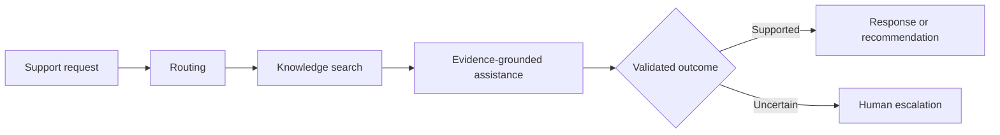

# Helix Support Intelligence

> Production-oriented search, routing, recommendation, and evidence-grounded assistance for customer-support operations.

[](https://github.com/rolffcoelho-bravo/helix-support-intelligence/actions/workflows/ci.yml)
[](#project-status)
[](https://www.python.org/)
[](LICENSE)

Helix Support Intelligence is a public applied-AI engineering project focused on a demanding operational question:

> How can a support platform automate useful decisions while keeping evidence, uncertainty, safety, latency, and cost observable?

The project combines machine learning, information retrieval, ranking, and generative AI inside one controlled support workflow. Language models are treated as replaceable components, not as the system itself.

## What Helix does

Helix is designed to support a fictional digital-banking service desk. It processes customer questions and helps determine the appropriate operational outcome:

- identify intent and route tickets;
- detect uncertain or out-of-scope requests;
- retrieve and rank relevant knowledge articles;
- recommend the next useful policy or resolution;
- draft responses grounded in approved evidence;
- attach traceable citations;
- request clarification or escalate when automation is unsafe.

The repository uses public or fictional data. It does not connect to real bank accounts, initiate transactions, or contain real customer information.

## Current release evidence

No performance result is claimed before a frozen, reproducible benchmark produces it.

| System | Routing macro-F1 | nDCG@10 | Unsupported claims | P95 latency | Cost/request |
|---|---:|---:|---:|---:|---:|
| Baseline | pending | pending | pending | pending | pending |
| Release candidate | pending | pending | pending | pending | pending |

Phase 2 development evidence is kept separate from release evidence. The A0/A1 and A2 validation checkpoints are documented under `benchmarks/routing/results/`; they do not populate this release table because the confirmatory test remains unopened and Phase 2 model selection is incomplete.

## Product workflow



The public [product contract](docs/product-contract.md) defines the finite v1 scope and every allowed terminal decision. The [architecture record](docs/architecture.md) describes the production boundaries without exposing confidential implementation material.

## Core capabilities

### Intelligent ticket routing

Helix models fine-grained customer intent, operational destination, uncertainty, and out-of-scope behaviour. Its purpose is not to maximize automation blindly, but to distinguish decisions that can be automated from those requiring human judgment.

### Hybrid search and ranking

The retrieval layer combines lexical and semantic search with reranking. Search quality is evaluated independently from generated answers so that retrieval failures are visible rather than hidden behind fluent text.

### Evidence-grounded assistance

Generated responses are constrained by retrieved knowledge and returned with citations. Unsupported, ambiguous, or conflicting cases are designed to fail safely through clarification or escalation.

### Next-best-resolution recommendation

Helix ranks relevant articles, approved troubleshooting paths, clarification questions, and escalation destinations for support agents. Recommendations remain read-only.

### Evaluation and observability

Model quality, retrieval relevance, calibration, citation behaviour, latency, cost, and operational decisions are treated as measurable system properties. The project emphasizes reproducible comparisons against clear baselines.

## Engineering character

Helix is being developed as a production-shaped repository rather than a notebook demonstration. The intended engineering surface includes:

- typed Python packages and API contracts;
- reproducible dependency and data management;
- automated testing and quality checks;
- versioned models, prompts, corpora, and configurations;
- containerized local execution;
- experiment tracking and model lifecycle management;
- traces, metrics, dashboards, and safe failure behaviour;
- public documentation for data provenance, limitations, and responsible use.

Exploratory notebooks may support analysis, but they will not contain the authoritative production implementation.

## Quick start

Prerequisites: Python 3.12+ and [uv](https://docs.astral.sh/uv/).

```bash
git clone https://github.com/rolffcoelho-bravo/helix-support-intelligence.git
cd helix-support-intelligence
make setup
make quality
uv run helix
```

The command returns foundation metadata and the declared terminal-decision vocabulary. It does not simulate a completed ML system.

The stable development commands are:

```bash
make lint            # static lint and formatting checks
make typecheck       # strict typing
make test            # unit tests
make data-check      # frozen Phase 1 data and contract invariants
make publication-audit
make quality         # all current release-blocking checks
```

## Technology direction

The planned stack is centered on Python, FastAPI, scikit-learn, PyTorch, Transformers, hybrid information retrieval, MLflow, OpenTelemetry, PostgreSQL, Redis, Docker Compose, and GitHub Actions.

Technology choices remain subordinate to measurable product value. A more complex component is adopted only when it demonstrates a meaningful advantage over a simpler baseline.

## Evaluation philosophy

Helix separates five forms of evidence:

| Layer | Representative evidence |
|---|---|
| Routing | classification quality, calibration, selective coverage |
| Retrieval | ranking relevance, recall, latency |
| Assistance | factual support, citation quality, refusal behaviour |
| Safety | privacy, adversarial robustness, bounded actions |
| System | reliability, latency, cost, observability |

Results will be published only after they are produced by reproducible evaluation. Empty result fields will remain clearly marked rather than filled with projected performance.

## Responsible-use boundaries

Helix is a research and portfolio system built with fictional or redistributable data. It is not a banking product, financial adviser, authentication service, or autonomous transaction agent.

The public implementation will not include:

- credentials, secrets, or private prompts;
- personal or real customer data;
- unrestricted tool execution;
- autonomous financial actions;
- claims of real-world impact unsupported by deployment evidence.

Security concerns should be reported through the process in [SECURITY.md](SECURITY.md). Do not open a public issue for a suspected vulnerability.

## Project status

The repository foundation and Phase 1 data/evaluation contracts are complete. Phase 2 routing work is active. Public development proceeds through a finite sequence:

1. reproducible engineering foundation — **complete**;
2. public-data and evaluation contracts — **complete**;
3. ticket-routing baseline — **active; A0/A1/A2 development checkpoints complete, A3 next**;
4. hybrid retrieval and ranking;
5. evidence-grounded assistance;
6. safety, observability, and system validation;
7. measured public release.

Within Phase 2, A2 is currently the leading validation candidate and A1 remains the required simpler reference. This is a development status, not a release claim: calibration selection, out-of-scope evaluation, routing-cost analysis, A3, the operating threshold, and the registered confirmatory test remain unresolved.

The project reaches completion at a documented `v1.0.0` release. Further domains or capabilities will be treated as separate post-v1 work rather than unfinished obligations of the initial repository.

The [Phase 0 exit report](docs/phase-reports/phase-0.md), [Phase 1 exit report](docs/phase-reports/phase-1.md), and active [Phase 2 report](docs/phase-reports/phase-2.md) record the stage gates and current execution state. Contributions must follow [CONTRIBUTING.md](CONTRIBUTING.md), including the public-material review.

## Author

**Rodolfo Pereira**  
ShockBridge Pulse Research Lab

## Citation

Pereira, Rodolfo. (2026). *Helix Support Intelligence: Production-Oriented Search, Routing, Recommendation, and Evidence-Grounded Support AI*. ShockBridge Pulse Research Lab. Python research software.

Machine-readable metadata is provided in [CITATION.cff](CITATION.cff).

## License

The public Helix Support Intelligence software and documentation are licensed under the [Apache License 2.0](LICENSE).

External datasets, model weights, and third-party components retain their original licences and will be documented separately. The Apache-2.0 licence applies only to material intentionally published in this public repository; it does not apply to private commercial modules, internal research artifacts, confidential data, or proprietary future editions.
