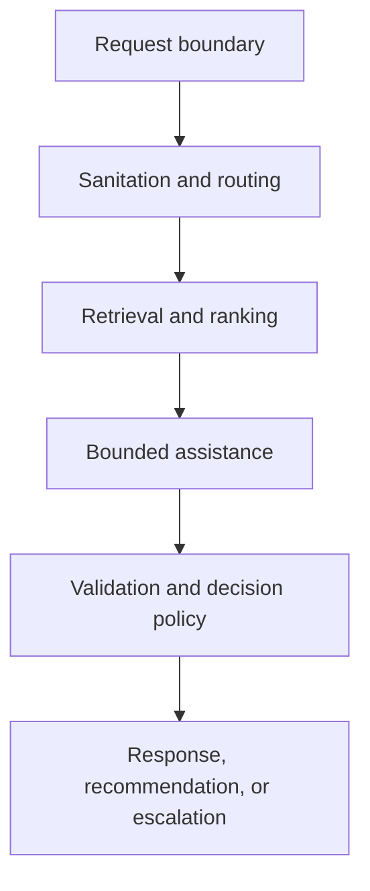

# Public Architecture

Helix separates decision policy from replaceable ML and generative components. Each request crosses typed boundaries and must terminate in one state from the public product contract.



## Component boundaries

| Boundary | Responsibility | Failure posture |
|---|---|---|
| Request | Validate schema and correlation metadata | Reject invalid input |
| Sanitation | Minimize and redact prohibited data | Escalate or reject |
| Routing | Predict intent, queue, and uncertainty | Abstain below support |
| Retrieval | Retrieve and rank approved evidence | Report missing or conflicting evidence |
| Assistance | Draft only from bounded context | No unsupported free-form fallback |
| Validation | Check schema, evidence, and policy constraints | Block or escalate |
| Observability | Record versions, decisions, latency, and failures | Preserve safe terminal behaviour |

## Phase 3 search boundary

`POST /v1/search` exposes the validated `retrieval-selected-v1` configuration through a small FastAPI boundary. The runtime path uses deterministic B0 BM25 because the more complex Phase 3 candidates did not satisfy the frozen relevance-and-latency adoption rule.

The search request contains only user query text and a bounded result limit. Query labels, intents, queues, expected decisions, gold citations, and relevance judgments are not accepted by the endpoint and are not used during ranking.

Before the BM25 index is constructed, the same evidence-eligibility contract used by the registered Phase 3 evaluation is applied to the fictional HelixBank corpus. Only current `public_support` documents for the `customer_support` audience in the `fictional-global` jurisdiction are eligible at the frozen corpus evaluation date. Archived evidence is excluded before ranking.

Successful responses contain deterministic ranked evidence with document ID, rank, score, title, body, document kind, and resolution type. The response does not include timestamps, random identifiers, or benchmark-only labels, so identical requests against the same selected configuration serialize identically.

Known backend-contract failures return HTTP 503 with the stable public code `SEARCH_UNAVAILABLE`; internal exception text is not returned to the caller. Invalid request bodies fail schema validation with HTTP 422.

## Repository boundaries

```text
src/        authoritative typed application code
tests/      automated public contract checks
scripts/    development and publication controls
docs/       public contracts, ADRs, and phase reports
```

The API implementation lives under `src/helix_support_intelligence/api/`; retrieval primitives remain under `src/helix_support_intelligence/retrieval/`. The HTTP layer depends on the typed retrieval service boundary rather than embedding ranking logic into route handlers.

Data, models, APIs, deployment services, and telemetry adapters enter only in their authorized phases. Interfaces should depend on domain contracts rather than provider-specific implementations.

## Architectural principles

1. Evidence and uncertainty are first-class outputs.
2. The language model is replaceable and cannot define system policy.
3. Read-only behaviour is the default.
4. Failures end in explicit, observable terminal states.
5. Complexity must outperform a simpler baseline under frozen evaluation.
6. Public documentation explains behaviour without publishing confidential prompts, security logic, or commercial modules.
