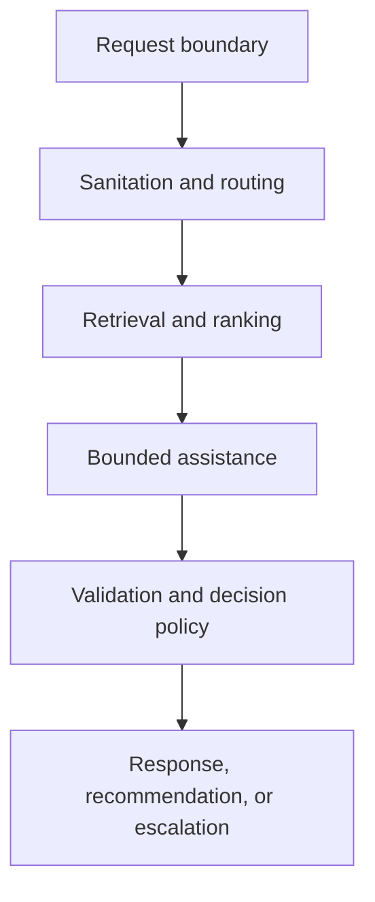

# Public Architecture

Helix separates decision policy from replaceable ML and generative components. Each request crosses typed boundaries and must terminate in one state from the public product contract.



## Component boundaries

| Boundary | Responsibility | Failure posture |
|---|---|---|
| Request | Validate schema and correlation metadata | Reject invalid input |
| Sanitation | Minimize and redact prohibited data | Escalate or reject |
| Routing | Predict intent, queue, and uncertainty | Abstain below support |
| Retrieval | Retrieve and rerank approved evidence | Report missing or conflicting evidence |
| Assistance | Draft only from bounded context | No unsupported free-form fallback |
| Validation | Check schema, evidence, and policy constraints | Block or escalate |
| Observability | Record versions, decisions, latency, and failures | Preserve safe terminal behaviour |

## Repository boundaries

```text
src/        authoritative typed application code
tests/      automated public contract checks
scripts/    development and publication controls
docs/       public contracts, ADRs, and phase reports
```

Data, models, APIs, deployment services, and telemetry adapters enter only in their authorized phases. Interfaces should depend on domain contracts rather than provider-specific implementations.

## Architectural principles

1. Evidence and uncertainty are first-class outputs.
2. The language model is replaceable and cannot define system policy.
3. Read-only behaviour is the default.
4. Failures end in explicit, observable terminal states.
5. Complexity must outperform a simpler baseline under frozen evaluation.
6. Public documentation explains behaviour without publishing confidential prompts, security logic, or commercial modules.
